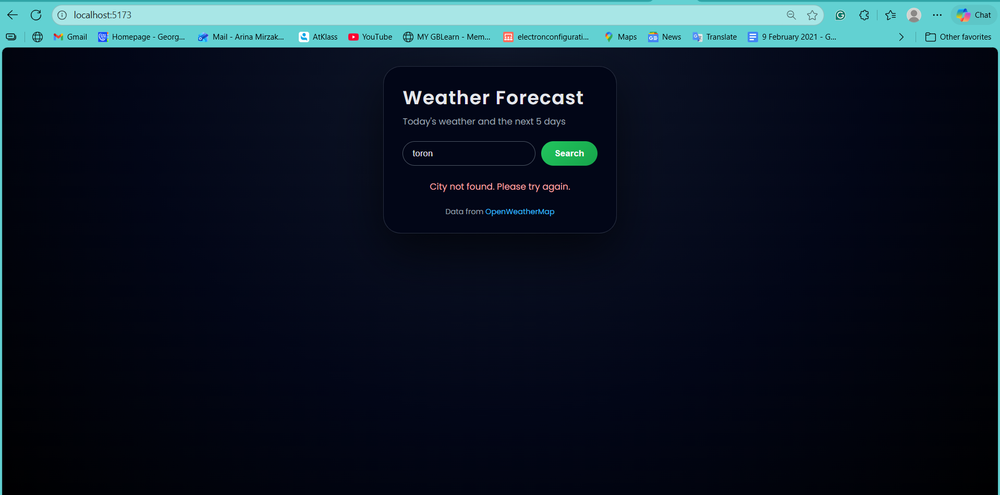
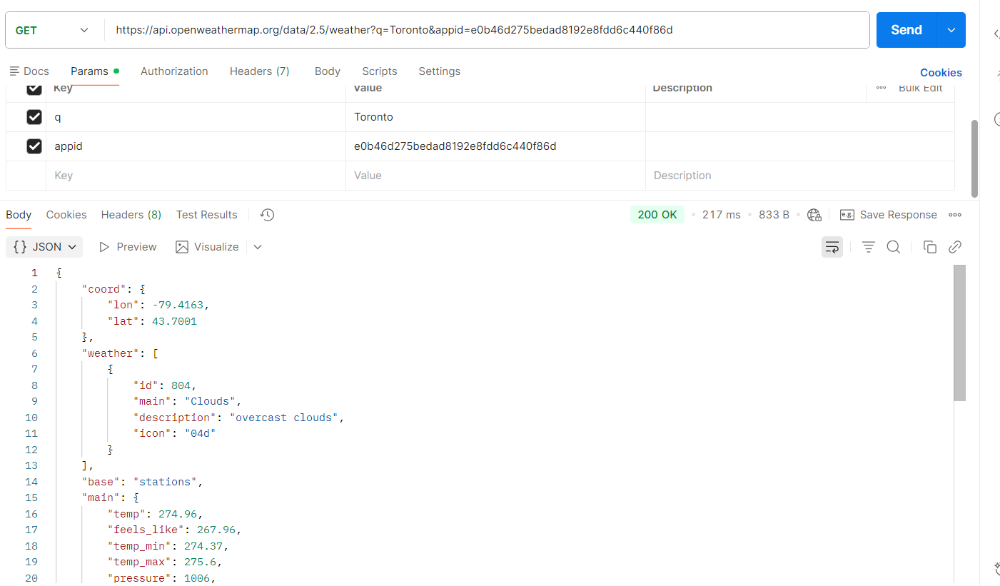

101418340_comp3123_labtest2 – Weather Forecast App

This is my COMP 3123 Lab Test 2 project.
It is a React-based Weather Forecast application that lets users:

Search for any city

View today’s weather (temperature, feels-like, condition)

View weather icon from OpenWeatherMap

See humidity, wind speed, and condition

Display a 5-day forecast using real API data

Enjoy a modern UI inspired by professional reference designs

This project was built using Vite + React and deployed on Vercel.

🌍 Live Deployment (Vercel)

🔗 Live App URL:
https://101418340-comp3123-labtest2.vercel.app/

📦 Project Setup (Step-by-Step)
1️⃣ Clone the Repository
git clone https://github.com/arinamirzakhani/101418340_comp3123_labtest2.git
cd 101418340_comp3123_labtest2

2️⃣ Install Dependencies
npm install

3️⃣ Create .env.local File

Create a file named .env.local in the project root and put:

VITE_OPENWEATHER_API_KEY=YOUR_API_KEY_HERE

⚠️ Do NOT add quotes
⚠️ Do NOT upload .env.local to GitHub
⚠️ Required for local development

4️⃣ Run the App
npm run dev

Open the URL shown in your terminal (usually http://localhost:5173).

🌤 API Used

This project uses OpenWeatherMap for real-time weather data.

1. Current Weather Endpoint
https://api.openweathermap.org/data/2.5/weather?q={city}&appid={API_KEY}&units=metric

Used for:

Temperature

Feels-like

Weather description

Icon

Humidity

Wind speed

2. 5-Day Forecast Endpoint
https://api.openweathermap.org/data/2.5/forecast?q={city}&appid={API_KEY}&units=metric

Used to generate the next 5 days mini forecast.

3. Local JSON Sample (Provided)
public/weather_api_output.json

You can switch between real API and local JSON in App.jsx:

const USE_LOCAL_JSON = false;

true → use local sample
false → use the live API

🖼 Screenshots

Add your screenshots before submission:
✔ Today’s weather
✔ Error (invalid city)
✔ Postman API test

Example placeholders:

🌆 Today’s Weather

❌ Error Message

📬 Postman API Response

